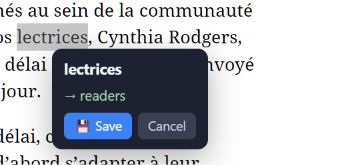
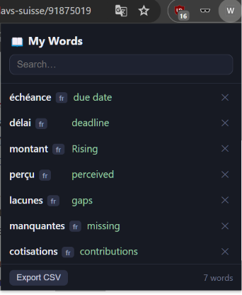
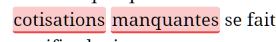
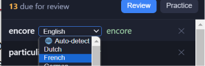

# Word Collector

double click a word and see the translation.
You can save the translation in your system.
Exporting to CSV is an option.

Generated using Qwen. I've went through the code as a proof
of concept and gonna work more on it later.

To use the extension on local machine,
Enable developer mode on Chrome,
Load unpacked and select the folder.

Example:

## Features

Words you encountered will highlighted based on your mastery level

Ability to change auto-detect language to your language of choice

